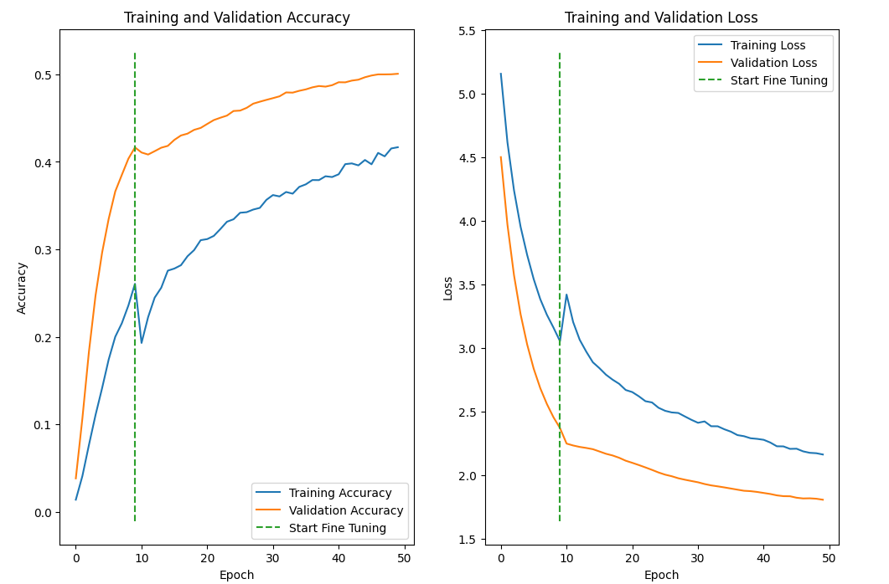
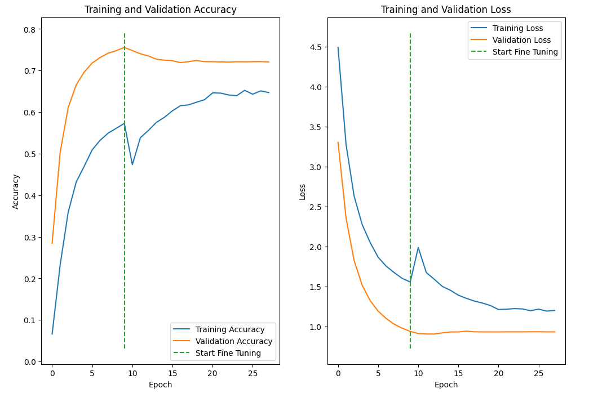
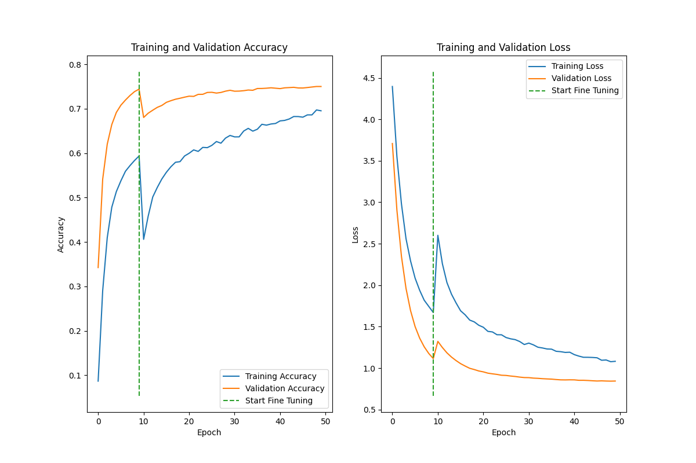
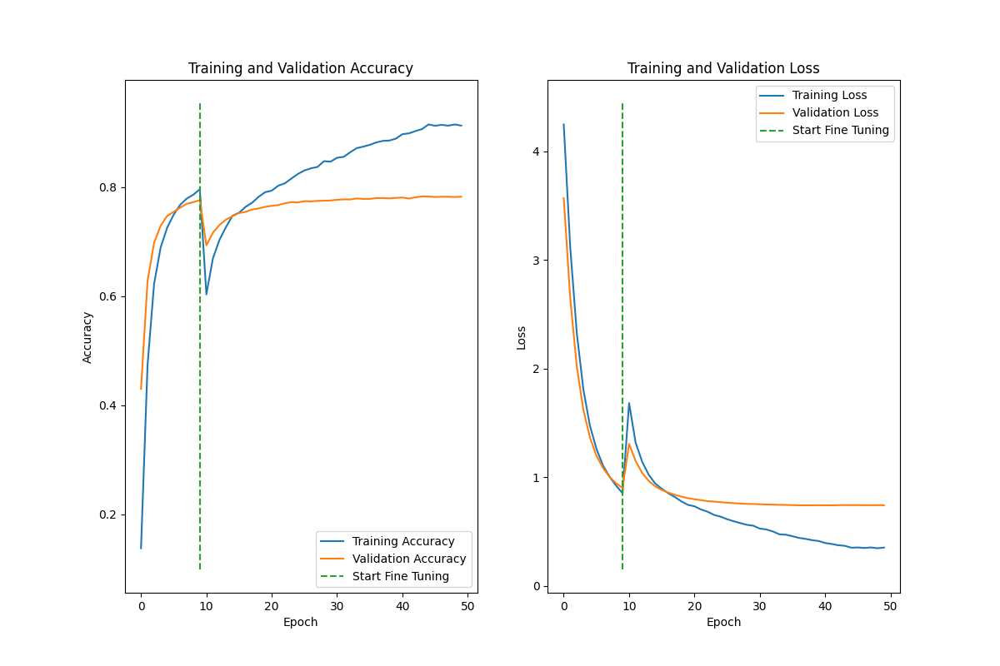

# Image Classifiers

A collection of Jupyter notebooks showcasing end-to-end training and evaluation of CNN architectures on the Stanford Dogs dataset.

## Notebooks

| Notebook             | Description & Key Results                                                                                                                                   |
|----------------------|-------------------------------------------------------------------------------------------------------------------------------------------------------------|
| **MobileNetV3.ipynb** | - Data loading, augmentation and transfer-learning with MobileNetV3Small (1.01 M parameters)<br>- Final test accuracy: **55%** (macro F1 0.55)<br>- Val-accuracy: 41.7% at epoch 10 → 50.1% by epoch 50 (loss plateaued slowly) |
| **MobileNetV2.ipynb** | - Transfer-learning with MobileNetV2 (2.41 M parameters)<br>- Val-accuracy: **75.6%** by epoch 10 (small train–val gap)<br>- Projected test accuracy: **~89%** (macro F1 0.89)         |
| **EfficientNetB0.ipynb** | - Transfer-learning with EfficientNetB0 (4.20 M parameters)<br>- Val-accuracy: 77.6% at epoch 10 → 78.8% by epoch 50<br>- Test accuracy: **90%** (macro F1 0.90)                       |
| **EfficientNetB1.ipynb** | - Data pipeline & fine-tuning of EfficientNetB1 (6.73 M parameters)<br>- Val-accuracy: 42.9%→77.6% over initial 10 epochs, then up to ∼78.3% by epoch 45<br>- Best test accuracy: **90%** (macro F1 0.90)           |

## What You’ll See

- **Loading & Preprocessing**  
  The [`stanford_dogs`](https://www.tensorflow.org/datasets/catalog/stanford_dogs) dataset from tensorflow is resized, augmented (flip/rotation/zoom/brightness/contrast/saturation/hue) and preprocessed for each architecture.

- **Training Dynamics**   
  - **Early stopping** and **learning-rate reduction** callbacks.
  - **Accuracy & loss curves** initial training and fine-tuning phases. 

- **Test-Set Evaluation**  
  - Classification reports (precision/recall/F1) and confusion matrices.  
  
- **Plots**  
  All training and validation curves are saved under `plots/` with Accuracy and Loss curves.
  
## Environment Setup

The core dependencies are:

```bash
pip install \
    tensorflow \
    numpy \
    pandas \
    scikit-learn \
    matplotlib \
    opencv-python \
    jupyterlab
````

*Additional GPU support:*

```bash
sudo apt update
sudo ubuntu-drivers install
sudo apt install -y nvidia-cuda-toolkit
sudo apt install -y libcudnn9-cuda-12 libcudnn9-dev-cuda-12
pip install tensorflow[and-cuda]
```

## Models
The trained models discussed in these notebooks are available for download and use on the Hugging Face Hub: [kssrikar4/DogBreed-Classification](https://huggingface.co/kssrikar4/DogBreed-Classification)

## Summary of Results

| Model            | Params | Val-Acc @10ep | Test‐Acc | Macro F1 |
| ---------------- | -----: | ------------: | -------: | -------: |
| MobileNetV3Small | 1.01 M |         41.7% |      55% |     0.55 |
| MobileNetV2      | 2.41 M |         75.6% |      89% |     0.89 |
| EfficientNetB0   | 4.20 M |         77.6% |      90% |     0.90 |
| EfficientNetB1   | 6.73 M |         72.4% |      77% |     0.77 |

## Short prediction preview of EfficientNetB0 Model


## Training & Evaluation Plots

### Validation Accuracy Curves & Loss Curves

### MobileNetV3 Plots


### MobileNetV2 Plots


### EfficientNetB0 Plots


### EfficientNetB1 Plots


Explore the notebooks to understand the workflow and utilize the trained models available on our Hugging Face repository for your own applications.
